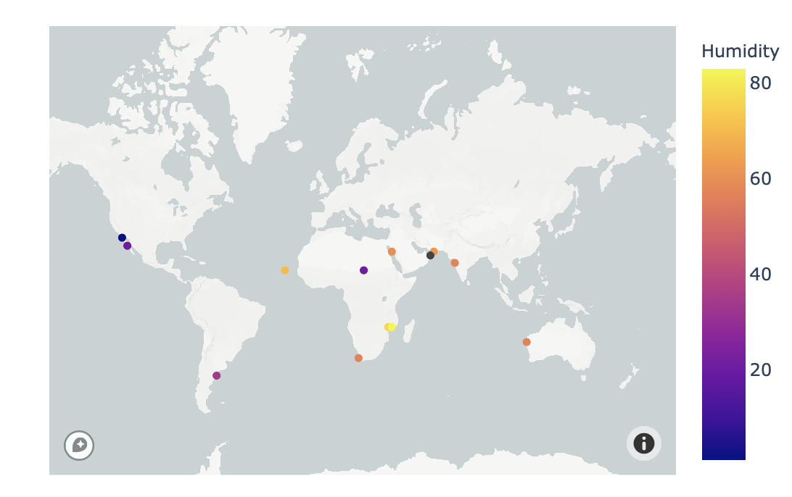

## WeatherPy
### Objective
Created a Python script to visualize the weather of 500+ cities across the world of varying distance from the
equator. Then compare max temperatures, wind speed, humidity, and cloudiness to the latitude and discover any
trends.

#### Generated a List of Random Cities
A list of 500 + random cities was created by making two variables with the respective ranges of latitude and
longitude, then zipping the lists together into a new list. The cities were found by utilizing citipy in a
for loop to append the city names to an empty list.

```python
# Generate cities list
cities = []
lat_lngs = []

# Create set of random lat and lng combos
lats = np.random.uniform(low=-90.000, high=90.000, size=1500)
lngs = np.random.uniform(low=-180.000, high=180.000, size=1500)
lat_lngs = zip(lats, lngs)

# Identify nearest city for the lat, lng
for lat_lng in lat_lngs:
    city = citipy.nearest_city(lat_lng[0], lat_lng[1]).city_name

    # add unique cities
    if city not in cities:
        cities.append(city)

len(cities)
```

#### Performed API Calls
To start off, a function was defined to extract data from the JSON output that included the name, lat, long,
max temperature, humidity, cloudiness, windspeed, country, and data. The data was retrieved by using the
OpenWeatherMap API in a for loop enumerating over the list of coordinates. A print log was extablished to
print out the record number and city as the data was being process. In order to not halt the retrieval, a
try/except was implemented within the for loop and would print out if a city was not found. The data was
extracted and appended to an empty list, then converted into a data frame and output to a csv.

```python
# Create lists for the weather findings of each city
city_name = []
country = []
date = []
lat_list = []
lng_list = []
max_temp = []
cloudiness = []
humidity = []
wind_speed = []
i = 1

for city in cities:

    r = requests.get(
        "http://api.openweathermap.org/data/2.5/weather?",
        params={"units": "imperial", "appid": weather_api_key, "q": city,},
    ).json()

    try:
        city_name.append(r["name"])
        country.append(r["sys"]["country"])
        date.append(r["dt"])
        lat_list.append(r["coord"]["lat"])
        lng_list.append(r["coord"]["lon"])
        max_temp.append(r["main"]["temp_max"])
        cloudiness.append(r["clouds"]["all"])
        humidity.append(r["main"]["humidity"])
        wind_speed.append(r["wind"]["speed"])

        print(f"Processing Record {i}|{city}")
        i += 1

    except (KeyError, IndexError):
        print("City not found")
```

#### Plotted Weather Data
Next, plots were created from the data that was retrieved during the API calls to observe any weather trends
when compared along the latitude for both the northern and southern hemisphere. Then additional plots were
made, separating the latitudes into southern and northern hemispheres to compare the weather trends and
linear regression respectively.


## VactionPy
### Objective
Planned future vacations by using the previously made city weather csv to find locations with the most ideal
weather.

#### Created a Data Frame of Cities with Ideal Weather
This dataframe was created by dropping rows with the max temperature over 70 and under 80, windspeeds under 10 mph,
and cloudiness at 0%

```python
# locate cities to find ideal weather conditions
ideal_cities_df = df.loc[
    (df["Wind Speed"] < 10)
    & (df["Clouds"] == 0)
    & (df["Max Temp"] > 70)
    & (df["Max Temp"] < 80)
].dropna()
ideal_cities_df
```

#### Obtained hotels in each city using Google Places API
For vacation planning, the first step is always to look at hotels in each city. This was done using Google Places Nearby Search API. The location parameter takes a very specific format of coordinates, so a new column was added to the dataframe by adding the latitude and longitude columns together, as strings, and separated by a comma. Similar to processing the weather APIs, first an extract function was define followed by a for loop iterating over the combined lat/lng column as a list. A record was printed for each coordinates in the try/except block to note when a hotel was found or not. The data was then extracted, appended to an empty list, and turned into a dataframe.

```python
# create lat/lng string for API calls and add to df
ideal_cities_df["lat_lng"] = (
    ideal_cities_df["Lat"].astype(str) + "," + ideal_cities_df["Lng"].astype(str)
)

# create list to iterate over
lat_lng_list = ideal_cities_df["lat_lng"].tolist()

# iterate over the lat_lng_list to find hotels near the cities
for index, row in ideal_cities_df.iterrows():
    lat = row["Lat"]
    lng = row["Lng"]
    city_name = row["City"]

    r = requests.get(
        "https://maps.googleapis.com/maps/api/place/nearbysearch/json",
        params={
            "type": "hotel",
            "keyword": "hotel",
            "radius": 10000,
            "key": g_key,
            "location": lat_lng_list,
        },
    ).json()
```

#### Merged Data Frames and Plotting
In order to merge the city weather data frame with the new hotels data frame, first the latitude and longitude columns needed to be rounded to the 0 decimal. Anything larger than 0 would not match up in the merge. The columns were then renamed for cleaner output in map plot.

```python
# merge dataframes on lat and lng columns for plotting
merged_df = pd.merge(
    hotel_df,
    ideal_cities_df,
    how="left",
    left_on=["Lat", "Lng"],
    right_on=["Lat", "Lng"],
)
```

The merged data frame was plotted using Plotly and Mapbox with the latitude and longitude of the hotels. The heatmap was created by assigning the Humidity column to color which colors cities by humidity percentage. Hover data shows the coordates, city, country, hotel name, and humidity for each plot point.

```python
fig = px.scatter_mapbox(
    merged_df,
    lat="Lat",
    lon="Lng",
    color="Humidity",
    hover_data=["Lat", "Lng", "City", "Country", "Hotel Name", "Humidity"],
)
```


