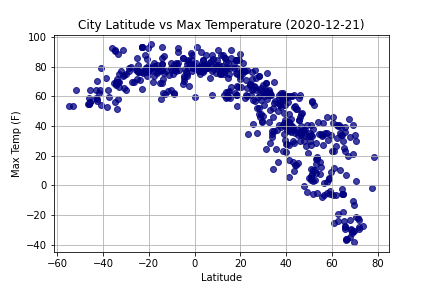
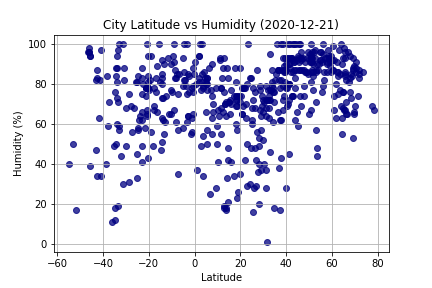
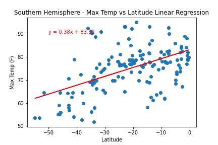
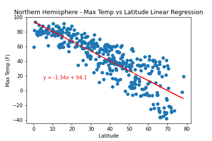

## WeatherPy
### Objective
Create a Python script to visualize the weather of 500+ cities across the world of varying distance from the
equator. Then compare max temperatures, wind speed, humidity, and cloudiness to the latitude and discover any
trends.

#### Generating a List of Random Cities
A list of 500 + random cities was created by making two variables with the respective ranges of latitude and
longitude, then zipping the lists together into a new list. The cities were found by utilizing citipy in a
for loop to append the city names to an empty list.

#### Perform API Calls
To start off, a function was defined to extract data from the JSON output that included the name, lat, long,
max temperature, humidity, cloudiness, windspeed, country, and data. The data was retrieved by using the
OpenWeatherMap API in a for loop enumerating over the list of coordinates. A print log was extablished to
print out the record number and city as the data was being process. In order to not halt the retrieval, a
try/except was implemented within the for loop and would print out if a city was not found. The data was
extracted and appended to an empty list, then converted into a data frame and output to a csv.

#### Plotting Weather Data
Next, plots were created from the data that was retrieved during the API calls to observe any weather trends
when compared along the latitude for both the northern and southern hemisphere. Then additional plots were
made, separating the latitudes into southern and northern hemispheres to compare the weather trends and
linear regression respectively.

